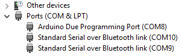
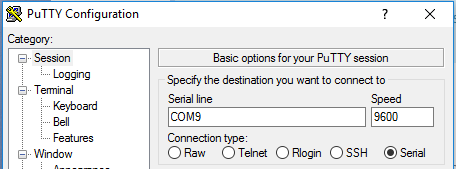

# GrowSystem
ESP32 Controlled Grow System

## Getting Started

### Arduino

### Bluetooth Terminal Communication
For Windows, I use putty.
* Expand “Ports (COM & LPT)” in Device Manager

* Launch PuTTY (or another terminal program if you choose.)

* Connect to the indicated COM port at baud rate 9600 (you can play with other baud rates if you prefer.)

### Windows Xamarin

Be sure to add to gitignore to cover this.